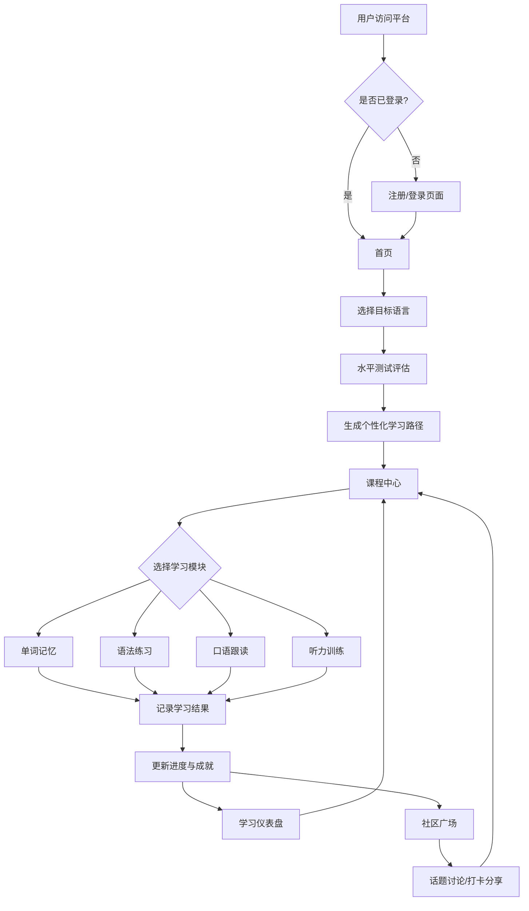
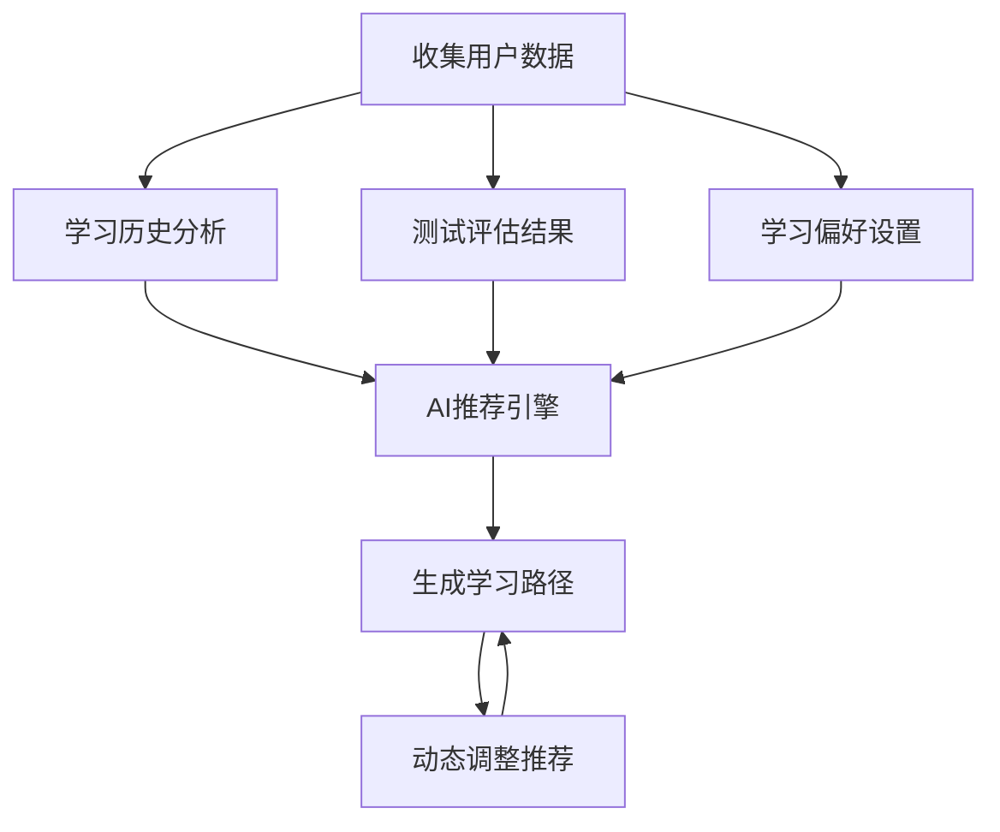

## 1. 产品概述

**LinguaFlow - 沉浸式多语种在线教育平台**

一款面向全球语言学习者的沉浸式在线学习平台，支持英语、日语、韩语等主流语言，提供从零基础到高级的完整课程体系。平台融合AI驱动的个性化推荐、互动式学习模块、社区交流与成就激励系统，打造高效、有趣的语言学习体验。

- **核心目标用户**：18-45岁语言学习者、职场人士、留学生备考人群
- **市场价值**：解决传统语言学习枯燥低效痛点，通过游戏化机制提升用户留存与学习效果

---

## 2. 核心功能

### 2.1 用户角色

| 角色 | 注册方式 | 核心权限 |
|------|----------|----------|
| 学习者 | 邮箱/手机/第三方登录 | 浏览课程、参与学习、社区互动、成就系统 |
| 管理员（预留） | 后台分配 | 课程管理、用户管理、内容审核 |

### 2.2 功能模块

1. **首页平台门户**：语言选择入口、课程展示、学习动态、特色介绍
2. **课程中心**：分级课程体系浏览、课程详情、章节目录
3. **互动学习模块**：
   - 单词记忆（闪卡、联想记忆）
   - 语法练习（填空、选择、改错）
   - 口语跟读（录音对比、发音评分）
   - 听力训练（音频播放、听写练习）
4. **学习仪表盘**：进度追踪、数据统计、学习日历、成就徽章
5. **个人中心**：个人信息、学习偏好设置、学习路径配置
6. **社区广场**：话题讨论、学习打卡、经验分享、问答互助
7. **用户认证**：注册、登录、密码找回、第三方OAuth接入

### 2.3 页面详情

| 页面名称 | 模块名称 | 功能描述 |
|-----------|-------------|---------------------|
| 首页 | Hero区域 | 多语种切换动画、品牌标语、CTA按钮、背景动效 |
| 首页 | 语言选择卡片 | 英语/日语/韩语三大语言入口，含等级预览 |
| 首页 | 特色展示 | 平台四大特色模块滚动展示 |
| 首页 | 学习动态 | 实时学习排行榜、今日学习人数统计 |
| 课程中心 | 课程分类导航 | 按语言/级别/类型筛选课程 |
| 课程中心 | 课程列表卡片 | 封面图、标题、难度标签、进度条、学习者数 |
| 课程中心 | 课程详情页 | 课程介绍、章节大纲、讲师信息、开始学习按钮 |
| 学习页面 | 单词记忆模块 | 闪卡翻转动画、发音播放、例句展示、掌握程度标记 |
| 学习页面 | 语法练习模块 | 题目展示、选项交互、即时反馈解析、连续答题统计 |
| 学习页面 | 口语跟读模块 | 原音播放、录音按钮、波形可视化、相似度评分 |
| 学习页面 | 听力训练模块 | 音频控制器、变速播放、听写输入区、答案对照 |
| 学习仪表盘 | 进度总览 | 环形进度图、本周学习时长、已学单词数、完成课程数 |
| 学习仪表盘 | 学习日历 | 日历热力图标记学习日期、点击查看当日详情 |
| 学习仪表盘 | 成就墙 | 徽章网格展示、解锁条件提示、获得时间线 |
| 个人中心 | 个人信息编辑 | 头像上传、昵称修改、目标语言设置 |
| 个人中心 | 学习路径推荐 | AI个性化路径卡片、调整建议、切换选项 |
| 社区广场 | 话题列表 | 话题卡片、热度排序、参与人数、最新回复 |
| 社区广场 | 话题详情 | 帖子内容、评论流、点赞收藏、发布回复 |
| 社区广场 | 学习打卡 | 日历打卡组件、连续天数统计、好友打卡动态 |
| 登录注册 | 认证表单 | 表单验证、错误提示、社交登录按钮 |

---

## 3. 核心流程

### 3.1 用户学习主流程

```
用户注册/登录 → 选择目标语言 → 进行水平测试 → 获得个性化学习路径 → 进入课程学习
→ 选择学习模块(单词/语法/口语/听力) → 完成练习 → 获得积分和成就 → 更新学习进度
→ 返回仪表盘查看统计 → 进入社区分享交流
```

### 3.2 流程图



### 3.3 个性化推荐流程



---

## 4. 用户界面设计

### 4.1 设计风格

**设计理念：「知识海洋」沉浸式体验**

- **主色调**：深海蓝 `#0A1628` 作为基底，搭配珊瑚橙 `#FF6B35` 作为活力强调色，青绿 `#00D9C0` 作为成功/完成状态色
- **辅助色**：柔和紫 `#7C3AED` 用于日语主题，暖黄 `#F59E0B` 用于韩语主题，纯净白 `#F8FAFC` 用于文字内容
- **按钮风格**：圆角胶囊形按钮（border-radius: 24px），带微妙渐变和悬浮发光效果
- **字体选择**：
  - 标题字体：`Outfit`（现代几何感，多字重支持）
  - 正文字体：`Noto Sans SC`（中文优化）+ `Inter`（英文/数字）
  - 日/韩语：`Noto Sans JP` / `Noto Sans KR`
- **布局风格**：卡片式布局 + 大量留白 + 微妙玻璃态效果（glassmorphism）
- **图标风格**：线性图标为主，配合语义化色彩
- **动效设计**：流畅过渡动画（300ms ease）、页面载入staggered reveal、悬浮微交互

### 4.2 页面设计概览

| 页面名称 | 模块名称 | UI元素描述 |
|-----------|-------------|-------------|
| 首页 | Hero区域 | 全屏渐变背景+粒子动效、大标题居中、三语言选择卡片悬浮排列、CTA按钮脉冲动画 |
| 首页 | 特色展示 | 四宫格卡片、图标+标题+简述、hover时上浮+阴影加深 |
| 课程中心 | 课程列表 | 瀑布流/网格布局、卡片含封面渐变遮罩、进度环、难度标签pill样式 |
| 学习页面 | 单词闪卡 | 3D翻转动效、正面显示单词+发音按钮、背面显示释义+例句、底部操作栏 |
| 学习页面 | 练习界面 | 居中题目卡片、选项竖列排列、正确/错误反馈动画、顶部进度指示器 |
| 仪表盘 | 数据概览 | Bento Grid布局、各模块独立卡片、环形图SVG动画、数字滚动效果 |
| 社区 | 话题流 | 左侧头像+昵称、中间内容区、右侧互动栏（点赞/评论）、分隔线 |
| 登录页 | 表单区域 | 居中卡片、玻璃态背景、表单字段浮动标签、社交登录图标行 |

### 4.3 响应式设计

- **桌面优先**（Desktop-first）：以1440px为基准设计宽度
- **平板适配**（768px-1024px）：双列布局调整为单列，侧边栏可收起
- **移动端适配**（<768px）：单列堆叠、底部Tab导航、触摸友好尺寸（最小44px触控区）
- **关键断点**：480px / 768px / 1024px / 1280px / 1536px

### 4.4 动效规范

| 动效类型 | 触发方式 | 时长 | 缓动函数 |
|-----------|----------|------|----------|
| 页面进入 | 路由切换 | 400ms | ease-out |
| 卡片悬浮 | hover | 200ms | cubic-bezier(0.4, 0, 0.2, 1) |
| 按钮点击 | click | 150ms | ease-in-out |
| 数字增长 | 进入视口 | 1000ms | ease-out |
| 闪卡翻转 | 点击/滑动 | 600ms | cubic-bezier(0.4, 0, 0.2, 1) |
| 模态框出现 | 触发 | 300ms | spring |
