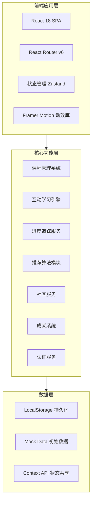
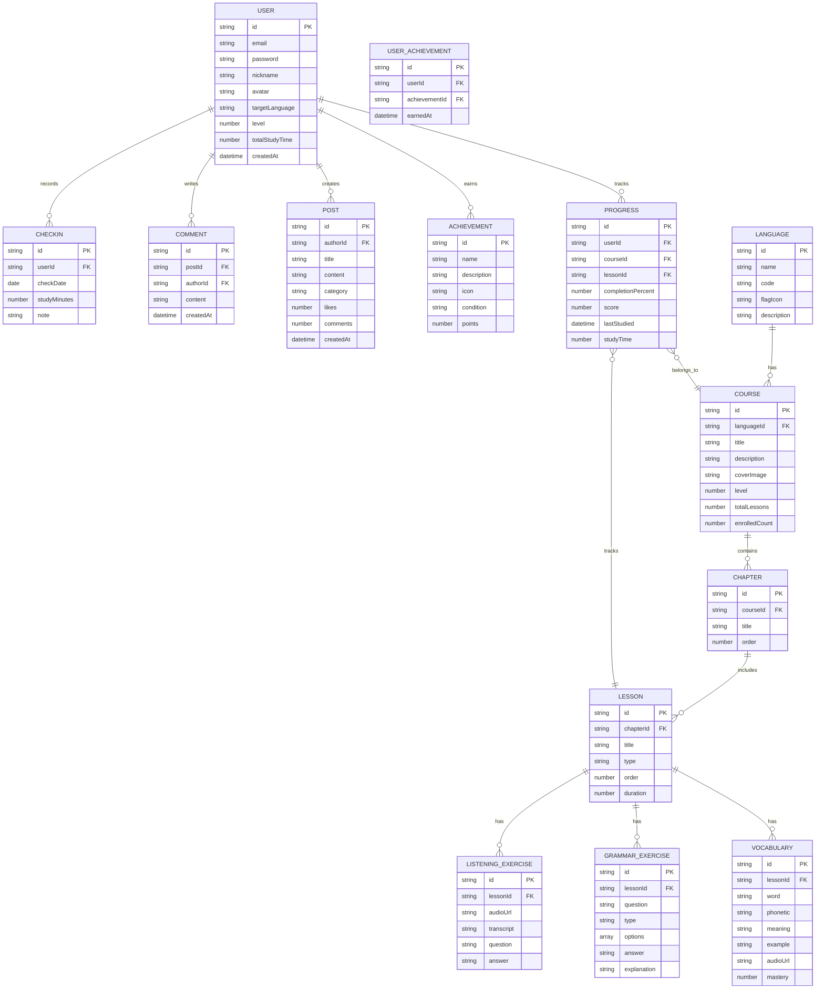

## 1. 架构设计

### 1.1 整体架构



### 1.2 技术选型理由

| 技术 | 选型原因 | 版本 |
|------|----------|------|
| React | 组件化生态丰富、虚拟DOM性能优秀 | 18.x |
| Vite | 极速HMR、原生ESM支持、构建速度快 | 5.x |
| Tailwind CSS | 原子化CSS、快速原型开发、响应式便捷 | 3.x |
| Zustand | 轻量级状态管理、API简洁、TypeScript友好 | 4.x |
| Framer Motion | 声明式动画、手势支持、性能优异 | 11.x |
| React Router v6 | 嵌套路由、懒加载支持、数据加载API | 6.x |

---

## 2. 技术栈说明

- **前端框架**：React@18 + TypeScript
- **构建工具**：Vite@5
- **样式方案**：Tailwind CSS@3 + 自定义CSS变量
- **状态管理**：Zustand（全局状态）+ Context API（局部状态）
- **路由管理**：React Router@6（懒加载路由）
- **动画方案**：Framer Motion + CSS Animations
- **图表库**：Recharts（数据可视化）
- **图标库**：Lucide React
- **字体**：Google Fonts (Outfit, Inter, Noto Sans SC/JP/KR)
- **初始化工具**：vite-create（create-vite模板）
- **后端方案**：纯前端实现（Mock Data + LocalStorage持久化）
- **数据库方案**：LocalStorage + JSON Mock Data

---

## 3. 路由定义

| 路由路径 | 页面名称 | 权限要求 | 说明 |
|----------|----------|----------|------|
| `/` | 首页 | 公开 | 平台门户、语言选择入口 |
| `/login` | 登录页 | 公开 | 用户登录表单 |
| `/register` | 注册页 | 公开 | 用户注册表单 |
| `/courses` | 课程中心 | 需登录 | 课程浏览与筛选 |
| `/courses/:id` | 课程详情 | 需登录 | 课程信息与章节列表 |
| `/learn/:courseId` | 学习主页 | 需登录 | 学习模块选择入口 |
| `/learn/:courseId/vocabulary` | 单词记忆 | 需登录 | 闪卡式单词学习 |
| `/learn/:courseId/grammar` | 语法练习 | 需登录 | 交互式语法题目 |
| `/learn/:courseId/speaking` | 口语跟读 | 需登录 | 录音跟读练习 |
| `/learn/:courseId/listening` | 听力训练 | 需登录 | 音频听力练习 |
| `/dashboard` | 学习仪表盘 | 需登录 | 进度统计与成就 |
| `/profile` | 个人中心 | 需登录 | 信息设置与路径配置 |
| `/community` | 社区广场 | 需登录 | 话题讨论与打卡 |
| `/community/:id` | 话题详情 | 需登录 | 帖子详情与评论 |

---

## 4. 数据模型

### 4.1 ER关系图



### 4.2 核心数据定义

#### 用户数据结构
```typescript
interface User {
  id: string;
  email: string;
  password: string;
  nickname: string;
  avatar: string;
  targetLanguage: 'en' | 'ja' | 'ko';
  level: number; // 1-6 对应 A1-C2
  totalStudyTime: number; // 分钟
  createdAt: string;
  preferences: {
    dailyGoal: number; // 每日目标分钟
    reminderEnabled: boolean;
    soundEnabled: boolean;
  };
}
```

#### 课程数据结构
```typescript
interface Course {
  id: string;
  languageId: string;
  title: string;
  description: string;
  coverImage: string;
  level: number; // 1-6
  category: 'vocabulary' | 'grammar' | 'speaking' | 'listening' | 'comprehensive';
  chapters: Chapter[];
  totalLessons: number;
  enrolledCount: number;
  rating: number;
  tags: string[];
}
```

#### 学习进度数据结构
```typescript
interface Progress {
  id: string;
  userId: string;
  courseId: string;
  lessonId: string;
  completionPercent: number; // 0-100
  score: number; // 0-100
  lastStudied: string;
  studyTime: number; // 秒
  vocabularyMastered: string[]; // 已掌握单词ID列表
  mistakes: string[]; // 错题ID列表
}
```

#### 成就系统数据结构
```typescript
interface Achievement {
  id: string;
  name: string;
  description: string;
  icon: string;
  category: 'streak' | 'vocabulary' | 'grammar' | 'speaking' | 'listening' | 'social';
  condition: { type: string; value: number };
  points: number;
  rarity: 'common' | 'rare' | 'epic' | 'legendary';
}
```

---

## 5. 项目目录结构

```
linguaflow/
├── public/
│   ├── favicon.ico
│   └── images/
│       └── hero-bg.svg
├── src/
│   ├── assets/
│   │   ├── styles/
│   │   │   ├── globals.css          # 全局样式与CSS变量
│   │   │   └── animations.css       # 自定义动画
│   │   └── data/
│   │       ├── courses.ts           # 课程Mock数据
│   │       ├── vocabulary.ts        # 单词库数据
│   │       ├── grammar.ts           # 语法题库数据
│   │       ├── listening.ts         # 听力材料数据
│   │       ├── achievements.ts      # 成就定义数据
│   │       ├── community.ts         # 社区初始数据
│   │       └── users.ts             # 用户Mock数据
│   ├── components/
│   │   ├── common/                  # 通用组件
│   │   │   ├── Button.tsx
│   │   │   ├── Card.tsx
│   │   │   ├── Modal.tsx
│   │   │   ├── ProgressBar.tsx
│   │   │   ├── Badge.tsx
│   │   │   ├── Avatar.tsx
│   │   │   └── LoadingSpinner.tsx
│   │   ├── layout/                  # 布局组件
│   │   │   ├── Header.tsx
│   │   │   ├── Footer.tsx
│   │   │   ├── Sidebar.tsx
│   │   │   ├── MobileNav.tsx
│   │   │   └── MainLayout.tsx
│   │   ├── home/                    # 首页组件
│   │   │   ├── HeroSection.tsx
│   │   │   ├── LanguageSelector.tsx
│   │   │   ├── FeatureShowcase.tsx
│   │   │   └── LiveStats.tsx
│   │   ├── course/                  # 课程组件
│   │   │   ├── CourseCard.tsx
│   │   │   ├── CourseList.tsx
│   │   │   ├── CourseDetail.tsx
│   │   │   └── ChapterList.tsx
│   │   ├── learn/                   # 学习模块组件
│   │   │   ├── VocabularyCard.tsx   # 单词闪卡
│   │   │   ├── GrammarQuiz.tsx      # 语法练习
│   │   │   ├── SpeakingPractice.tsx # 口语跟读
│   │   │   ├── ListeningExercise.tsx# 听力训练
│   │   │   ├── LearnHeader.tsx      # 学习页顶栏
│   │   │   └── ResultSummary.tsx    # 练习结果汇总
│   │   ├── dashboard/               # 仪表盘组件
│   │   │   ├── ProgressOverview.tsx
│   │   │   ├── StudyCalendar.tsx
│   │   │   ├── AchievementWall.tsx
│   │   │   └── StatsCard.tsx
│   │   ├── profile/                 # 个人中心组件
│   │   │   ├── ProfileForm.tsx
│   │   │   └── LearningPath.tsx
│   │   ├── community/               # 社区组件
│   │   │   ├── PostCard.tsx
│   │   │   ├── PostDetail.tsx
│   │   │   ├── CommentSection.tsx
│   │   │   ├── CheckInCalendar.tsx
│   │   │   └── CreatePost.tsx
│   │   └── auth/                    # 认证组件
│   │       ├── LoginForm.tsx
│   │       └── RegisterForm.tsx
│   ├── pages/                       # 页面组件
│   │   ├── HomePage.tsx
│   │   ├── LoginPage.tsx
│   │   ├── RegisterPage.tsx
│   │   ├── CoursesPage.tsx
│   │   ├── CourseDetailPage.tsx
│   │   ├── LearnPage.tsx
│   │   ├── VocabularyPage.tsx
│   │   ├── GrammarPage.tsx
│   │   ├── SpeakingPage.tsx
│   │   ├── ListeningPage.tsx
│   │   ├── DashboardPage.tsx
│   │   ├── ProfilePage.tsx
│   │   ├── CommunityPage.tsx
│   │   └── PostDetailPage.tsx
│   ├── stores/                      # 状态管理
│   │   ├── useAuthStore.ts          # 认证状态
│   │   ├── useCourseStore.ts        # 课程状态
│   │   ├── useProgressStore.ts      # 进度状态
│   │   ├── useCommunityStore.ts     # 社区状态
│   │   └── useAchievementStore.ts   # 成就状态
│   ├── hooks/                       # 自定义Hooks
│   │   ├── useAuth.ts               # 认证逻辑
│   │   ├── useProgress.ts           # 进度计算
│   │   ├── useSpeech.ts             # 语音合成/识别
│   │   └── useLocalStorage.ts       # 本地存储封装
│   ├── utils/                       # 工具函数
│   │   ├── storage.ts               # 存储工具
│   │   ├── formatters.ts            # 格式化工具
│   │   ├── validators.ts            # 表单验证
│   │   └── recommendations.ts       # 推荐算法
│   ├── types/                       # TypeScript类型定义
│   │   ├── index.ts                 # 类型导出汇总
│   │   ├── user.ts
│   │   ├── course.ts
│   │   ├── learning.ts
│   │   └── community.ts
│   ├── constants/                   # 常量定义
│   │   ├── languages.ts             # 支持语言配置
│   │   ├── levels.ts                # 等级定义
│   │   └── routes.ts                # 路由常量
│   ├── App.tsx                      # 应用根组件
│   ├── main.tsx                     # 入口文件
│   └── router.tsx                   # 路由配置
├── index.html
├── package.json
├── tailwind.config.js
├── tsconfig.json
├── tsconfig.node.json
├── vite.config.ts
└── postcss.config.js
```

---

## 6. 关键技术实现方案

### 6.1 单词闪卡3D翻转效果
- 使用 CSS `perspective` + `transform-style: preserve-3d`
- 正反面绝对定位，backface-visibility 控制
- Framer Motion 控制翻转动画时序

### 6.2 口语跟读功能
- 使用 Web Speech API (SpeechRecognition) 进行语音识别
- 使用 SpeechSynthesis API 播放原音
- Canvas 绘制音频波形可视化
- 简单的文本相似度算法进行评分

### 6.3 学习进度追踪
- Zustand store 管理 progress 状态
- LocalStorage 持久化确保刷新不丢失
- Recharts 绘制学习曲线图表
- 日历热力图展示学习频率

### 6.4 个性化推荐逻辑
- 基于用户等级和学习历史的简单规则引擎
- 考虑因素：已完成课程、薄弱环节、学习频率
- 生成推荐课程列表和学习计划

### 6.5 成就系统
- 事件驱动：监听学习行为触发成就检查
- 条件匹配：满足条件自动解锁并通知
- 稀有度分级：Common/Rare/Epic/Legendary
- 积分累计：成就点数可兑换虚拟奖励

---

## 7. 性能优化策略

| 优化项 | 方案 | 预期效果 |
|--------|------|----------|
| 路由懒加载 | React.lazy + Suspense | 首屏加载减少60% |
| 图片优化 | WebP格式 + 懒加载 | 图片资源减少40% |
| 代码分割 | 动态import()按需加载 | 包体积优化 |
| 状态持久化 | Zustand persist中间件 | 用户体验流畅 |
| 字体优化 | font-display: swap | FOIT避免 |
| 动画性能 | will-change + GPU加速 | 60fps流畅度 |
